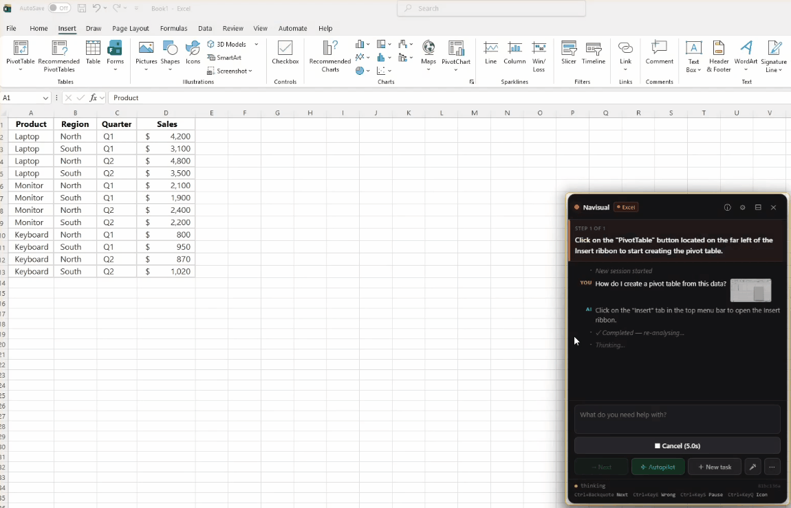

# Navisual

**The AI guides, never overrides.**

[](https://youtu.be/d-a2IARS0PU)

Navisual watches your screen and walks you through any task step by step — pointing at the exact button to click, narrating each action, and reading the current state of your app. The AI never moves your mouse, clicks, or types for you. Every action stays in your hands.

**[Download for Windows](https://navisualguide.com)** · [View on GitHub](https://github.com/NavisualGuide/navisual) · [navisualguide.com](https://navisualguide.com)

> **50 free requests included — no sign-up, no API key required.**

---

## AI Providers

| Provider | Setup | Cost |
|----------|-------|------|
| **Managed (free, default)** | None — works on first launch | 50 free requests, then paid |
| Gemini | Free key at [aistudio.google.com](https://aistudio.google.com/apikey) | Free tier available |
| Anthropic (Claude) | Key at [console.anthropic.com](https://console.anthropic.com) | Pay per use |
| OpenAI | Key at [platform.openai.com](https://platform.openai.com) | Pay per use |
| DeepSeek | Key at [platform.deepseek.com](https://platform.deepseek.com) | Pay per use (text-only — can't see the screen) |
| Qwen / OpenAI-compatible | DashScope key, **or any OpenAI-compatible endpoint** (LM Studio, llama.cpp, llamafile, vLLM) via a custom Base URL | Pay per use — or free when self-hosted |
| Ollama (local) | [ollama.com](https://ollama.com) + `ollama pull llama3.2-vision` | Free, nothing leaves your machine |

Configure your provider in-app via **Settings → Provider** — no file editing required.

**Run locally — two ways:** the **Ollama** provider (native API), or the **Qwen / OpenAI-compatible** provider pointed at any OpenAI-compatible server (LM Studio `…:1234/v1`, llama.cpp / llamafile `…:8080/v1`). Load a *vision* model, enter any dummy API key, and nothing leaves your machine.

---

## Quick Start

1. **[Download the installer](https://navisualguide.com)** and run `Navisual-Setup.exe`
2. Launch Navisual — it signs you in anonymously and gives you 50 free requests
3. Type what you need help with: *"How do I export a PDF in Illustrator?"*
4. Follow the on-screen arrows and spoken instructions
5. Press <kbd>Ctrl</kbd>+<kbd>`</kbd> when you've completed each step to advance

---

## Features

- **Observe, never act** — reads your screen, never moves the mouse or types
- **Screen Guide** — visual pointers land on the exact button, tab, or field
- **Live captions** — subtitle strip shows the current instruction
- **Audio narration** — TTS via Windows SAPI, no install required
- **Voice input** — push-to-talk via Web Speech API
- **Free managed tier** — 50 requests out of the box, no account needed
- **Multi-provider AI** — 6 BYOK providers (incl. DeepSeek & Qwen for China) plus any OpenAI-compatible local server (LM Studio, llama.cpp, llamafile)
- **Windows UI Automation** — primary element locator, < 5ms for browsers
- **Windows built-in OCR** — zero model downloads, works offline
- **Active-window crop** — only the relevant window is sent to the AI
- **Autopilot mode** — auto-advances when the screen changes, no hotkey needed
- **Multi-step sequences** — groups related actions to reduce API calls
- **Session persistence** — conversation and state survive app restarts

---

## Hotkeys

| Key | Action |
|-----|--------|
| <kbd>Ctrl</kbd>+<kbd>`</kbd> | Next step — confirm completed and advance |
| <kbd>Ctrl</kbd>+<kbd>E</kbd> | Wrong — re-analyze the current screen |
| *(not set)* | Pause / resume capture |
| *(not set)* | Show / hide the panel |
| <kbd>Ctrl</kbd>+<kbd>D</kbd> | Push-to-talk voice input |

All hotkeys are configurable in **Settings → Hotkeys**.

---

## Privacy

**What stays on your machine:** element matching (UIA + OCR), session history, settings, and cost tracking. The AI returns *text descriptions* of UI elements; your machine finds the pixels — coordinates are never sent.

**What gets sent to the AI:** a screenshot of the active window only (not the full desktop) plus your conversation text.

| Provider | Where the screenshot goes |
|---|---|
| **Managed — free (default)** | Supabase Edge Function → OpenRouter → free AI models (Google/NVIDIA) — **may be retained & used to train their models** (see note below) |
| **Managed — paid** | Supabase Edge Function → Google/OpenAI paid endpoints — not used for training |
| Anthropic | `api.anthropic.com` |
| Gemini | `generativelanguage.googleapis.com` |
| OpenAI | `api.openai.com` |
| DeepSeek | `api.deepseek.com` (text-only — screenshot not sent) |
| Qwen / OpenAI-compatible | `dashscope.aliyuncs.com`, or your configured endpoint — including a local server (nothing leaves your machine) |
| Ollama | `http://localhost:11434` — nothing leaves your machine |

Additional notes:
- **Free managed tier & model training:** the free tier is served by *free-of-charge* AI models (via OpenRouter — currently Google's and NVIDIA's free models), and those providers may retain your requests — **including the screenshot** — and use them to train their models. This is how the models are offered for free. To avoid it, use the **paid** managed tier (Google/OpenAI paid endpoints — no training), a **bring-your-own-key** provider on a *paid* plan (a provider's own *free* key may still train — check its policy), or **Ollama** (fully local). See the [Privacy Policy](https://navisualguide.com/privacy.html).
- Screenshots are held in memory only — never written to disk at default settings
- Full-screen / multi-monitor capture requires explicit one-time permission each time
- Assign a Pause hotkey in **Settings → Hotkeys** to stop all capture instantly
- Settings and auth token live in `%LOCALAPPDATA%\com.navisual.app\`
- On the free tier, a one-way hash of a Windows machine identifier is sent with requests so the 50 free requests are counted per device (it can't be reversed to identify your machine, and is used only to enforce the free limit — not on paid or bring-your-own-key providers)
- Voice input (optional) uses the WebView2 Web Speech API, which sends your spoken audio to Microsoft's online speech service
- Debug captures are off by default; when enabled, files older than 7 days are auto-deleted

---

## Architecture

For a short technical tour of the data flow, element locator, and key design decisions, see [ARCHITECTURE.md](ARCHITECTURE.md).

---

## Roadmap

```
v0.5    ✅ Free managed tier · auto-updater · signed installer · 6 BYOK providers
        🔜 Pay-as-you-go coin purchases (Stripe)
v0.6    Template matching · Nav-Packs for Blender / SolidWorks
v1.0    Microsoft Store · enterprise features · public launch
v1.x    macOS · Linux
```

---

## Build from Source

For contributors or developers who want to run from source:

**Prerequisites:** [Rust](https://rustup.rs/) (stable), [Node.js](https://nodejs.org/) 18+, [Visual Studio C++ Build Tools](https://visualstudio.microsoft.com/visual-cpp-build-tools/), [WebView2](https://developer.microsoft.com/en-us/microsoft-edge/webview2/) (pre-installed on Windows 11)

```powershell
git clone https://github.com/NavisualGuide/navisual.git
cd navisual
npm install
npm run tauri dev      # development (hot reload)
npm run tauri build    # production binary → src-tauri/target/release/
```

Settings (dev and production) are read from `%LOCALAPPDATA%\com.navisual.app\.env`. Copy `.env.example` there to pre-configure. The project-root `.env` is not read.

---

## Contributing

Issues and pull requests are welcome. See [ARCHITECTURE.md](ARCHITECTURE.md) for an orientation to the codebase.

---

## License

[FSL-1.1-Apache-2.0](https://fsl.software/) — source-available. Each version converts to Apache 2.0 two years after its release date.
