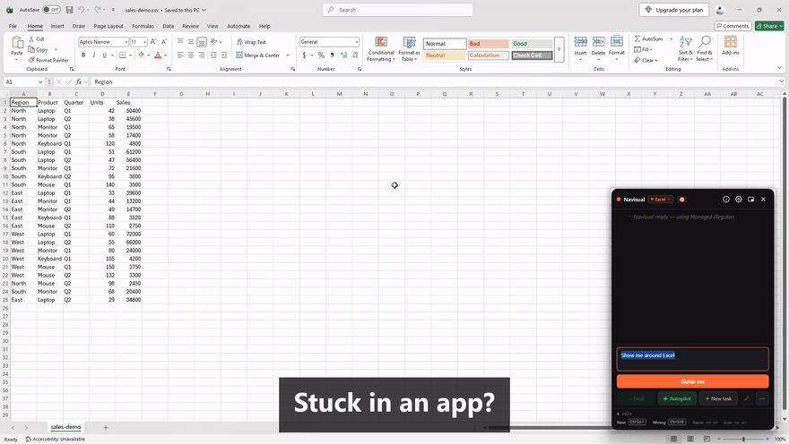

# Navisual

**An AI that sees, solves, and can be seen — you make the call.**

[](https://youtu.be/_C-3g769eig)

Most AI is invisible at the moment it matters. An agent clicks and you see only the aftermath; a chatbot answers in a separate window and you're still hunting for the button it means.

Navisual understands what's on your screen, works out what to do about it, and renders the answer **onto that screen** — pointing at the exact control, narrating the step, and stopping there. It never moves your mouse, clicks, or types. Every action stays yours.

Because the answer is drawn *before* anything happens, a wrong answer is visibly wrong — and you simply don't click. The pointer isn't the product; it's how the model's conclusion gets delivered onto your real screen, on your version, in your window.

**[Download for Windows](https://navisualguide.com)** · [User guide](https://navisualguide.com/docs.html) · [View on GitHub](https://github.com/NavisualGuide/navisual) · [navisualguide.com](https://navisualguide.com)

> **30 free requests included — no sign-up, no API key required.**

---

## AI Providers

| Provider | Setup | Cost |
|----------|-------|------|
| **Managed (free, default)** | None — works on first launch | 30 free requests, then paid |
| Gemini | Free key at [aistudio.google.com](https://aistudio.google.com/apikey) | Free tier available |
| Anthropic (Claude) | Key at [console.anthropic.com](https://console.anthropic.com) | Pay per use |
| OpenAI | Key at [platform.openai.com](https://platform.openai.com) | Pay per use |
| DeepSeek | Key at [platform.deepseek.com](https://platform.deepseek.com) | Pay per use (text-only — can't see the screen) |
| Qwen / OpenAI-compatible | DashScope key, **or any OpenAI-compatible endpoint** (LM Studio, llama.cpp, llamafile, vLLM) via a custom Base URL | Pay per use — or free when self-hosted |
| Ollama (local) | [ollama.com](https://ollama.com) + `ollama pull llama3.2-vision` | Free, nothing leaves your machine |

Configure your provider in-app via **Settings → Provider** — no file editing required.

**Run locally — two ways:** the **Ollama** provider (native API), or the **Qwen / OpenAI-compatible** provider pointed at any OpenAI-compatible server (LM Studio `…:1234/v1`, llama.cpp / llamafile `…:8080/v1`). Load a *vision* model, enter any dummy API key, and nothing leaves your machine.

---

## Quick Start

1. **[Download the installer](https://navisualguide.com)** and run `Navisual-Setup.exe`
2. Launch Navisual — it signs you in anonymously and gives you 30 free requests
3. Type what you need help with: *"How do I export a PDF in Illustrator?"*
4. Follow the on-screen arrows and spoken instructions
5. Press <kbd>Ctrl</kbd>+<kbd>`</kbd> when you've completed each step to advance

---

## Features

- **Observe, never act** — understands your screen, never moves the mouse or types
- **Screen Guide** — visual pointers land on the exact button, tab, or field
- **Live captions** — subtitle strip shows the current instruction
- **Audio narration** — TTS via Windows SAPI, no install required
- **Voice input** — push-to-talk via Web Speech API
- **Free managed tier** — 30 requests out of the box, no account needed
- **Multi-provider AI** — 6 BYOK providers (incl. DeepSeek & Qwen for China) plus any OpenAI-compatible local server (LM Studio, llama.cpp, llamafile)
- **Windows UI Automation** — primary element locator, < 5ms for browsers
- **Windows built-in OCR** — zero model downloads, works offline
- **Active-window crop** — only the relevant window is sent to the AI
- **Autopilot mode** — auto-advances when the screen changes, no hotkey needed
- **Multi-step sequences** — groups related actions to reduce API calls
- **Session persistence** — conversation and state survive app restarts

---

## Hotkeys

| Key | Action |
|-----|--------|
| <kbd>Ctrl</kbd>+<kbd>`</kbd> | Next step — confirm completed and advance |
| <kbd>Ctrl</kbd>+<kbd>E</kbd> | Wrong — re-analyze the current screen |
| *(not set)* | Pause / resume capture |
| *(not set)* | Show / hide the panel |
| <kbd>Ctrl</kbd>+<kbd>D</kbd> | Push-to-talk voice input |

All hotkeys are configurable in **Settings → Hotkeys**.

---

## Privacy

**What stays on your machine:** element matching (UIA + OCR), session history, settings, and cost tracking. The AI returns *text descriptions* of UI elements; your machine finds the pixels — coordinates are never sent.

**What gets sent to the AI:** a screenshot of the active window only (not the full desktop) plus your conversation text.

| Provider | Where the screenshot goes |
|---|---|
| **Managed — free (default)** | Supabase Edge Function → a free-tier AI provider (the specific provider may change over time) — **may be retained & used to train their models** (see note below) |
| **Managed — paid** | Supabase Edge Function → paid AI provider endpoints — not used for training under their current API policies |
| Anthropic | `api.anthropic.com` |
| Gemini | `generativelanguage.googleapis.com` |
| OpenAI | `api.openai.com` |
| DeepSeek | `api.deepseek.com` (text-only — screenshot not sent) |
| Qwen / OpenAI-compatible | `dashscope.aliyuncs.com`, or your configured endpoint — including a local server (nothing leaves your machine) |
| Ollama | `http://localhost:11434` — nothing leaves your machine |

Additional notes:
- **Free managed tier & model training:** the free tier is served by *free-of-charge* AI models — we route to whichever provider currently offers the best reliability/cost for the free tier, and that routing changes from time to time — and free-tier providers commonly retain your requests — **including the screenshot** — and use them to train their models. This is typically how free-of-charge AI access is offered. To avoid it, use the **paid** managed tier (paid provider endpoints, which under their *current* policies don't train on API data — their policy, which can change), a **bring-your-own-key** provider on a *paid* plan (a provider's own *free* key may still train — check its policy), or **Ollama** (fully local — the only option that doesn't depend on a provider's policy). See the [Privacy Policy](https://navisualguide.com/privacy.html).
- Screenshots are held in memory only — never written to disk at default settings
- Full-desktop / single-screen capture is never automatic — you choose it yourself in the target picker, and it stays until you pick a window again
- **Optional app add-ons:** for apps that draw their own UI (currently Blender), Navisual offers a small add-on so the app can report where its tools are. It is opt-in twice over — you click Install, then tick its checkbox in the app's own add-on settings — **read-only** (it cannot click, type, run commands, or modify your file), and listens only on `127.0.0.1` with no internet access. The interface facts it reports (mode, active tool/brush, object names) are included in the AI request; file contents and paths are not. See [Privacy Policy §3](https://navisualguide.com/privacy.html)
- Assign a Pause hotkey in **Settings → Hotkeys** to stop all capture instantly
- Settings and auth token live in `%LOCALAPPDATA%\com.navisual.app\`
- On the free tier, a one-way hash of a Windows machine identifier is sent with requests so the 30 free requests are counted per device (it can't be reversed to identify your machine, and is used only to enforce the free limit — not on paid or bring-your-own-key providers)
- Voice input (optional) uses the WebView2 Web Speech API, which sends your spoken audio to Microsoft's online speech service
- Debug captures are off by default; when enabled, files older than 7 days are auto-deleted

---

## Architecture

**The AI returns a text description of the target, never pixel coordinates.** A local element
locator resolves it against the live UI — app object-model adapters, then AI element *selection*
verified against the accessibility tree, then a framework-routed UIA search, then OCR with a
corroboration gate, then icon template matching. Grounding accuracy comes from the machine's own
accessibility data rather than the model's spatial reasoning, which is why a cheap model is
enough.

**The derivation is inspectable, not just the answer.** The debug drawer records which pass
resolved the target (`hit_adapter`, `hit_selection`, `hit_a11y`, `hit_ocr`, `hit_template`),
every candidate considered, the reason each was rejected, and the model's own predicted box
beside the resolved rect — so a wrong pointer can be diagnosed instead of guessed at.

For a short technical tour of the data flow, element locator, and key design decisions, see [ARCHITECTURE.md](ARCHITECTURE.md).

---

## Roadmap

Current release: **v0.7.8** · [release notes](https://github.com/NavisualGuide/navisual/releases)

```
v0.5   ✅ Free managed tier · signed installer + auto-updater · 6 BYOK providers
          pay-as-you-go coins (Stripe) · account management
v0.6   ✅ App-aware locator — Excel cell adapter · Nav-Packs (66-icon Blender pack)
          theme-robust icon template matching · per-monitor DPI prior
v0.7   ✅ Structured-Context locator ("select, don't ground") — the AI picks an
          element id from a verified on-screen list instead of guessing coordinates
       ✅ Office COM adapters (Word / PowerPoint) · Blender script-channel add-on
       ✅ Autopilot block-diff change detection · disabled-control awareness
v1.0   🔜 Microsoft Store (MSIX) · enterprise SSO + audit logs · Nav-Pack plugin
          system · browser companion extension · subscriptions
v1.x      macOS · Linux
```

---

## Build from Source

For contributors or developers who want to run from source:

**Prerequisites:** [Rust](https://rustup.rs/) (stable), [Node.js](https://nodejs.org/) 18+, [Visual Studio C++ Build Tools](https://visualstudio.microsoft.com/visual-cpp-build-tools/), [WebView2](https://developer.microsoft.com/en-us/microsoft-edge/webview2/) (pre-installed on Windows 11)

```powershell
git clone https://github.com/NavisualGuide/navisual.git
cd navisual
npm install
npm run tauri dev      # development (hot reload)
npm run tauri build    # production binary → src-tauri/target/release/
```

Settings (dev and production) are read from `%LOCALAPPDATA%\com.navisual.app\.env`. Copy `.env.example` there to pre-configure. The project-root `.env` is not read.

---

## Contributing

Issues and pull requests are welcome. See [ARCHITECTURE.md](ARCHITECTURE.md) for an orientation to the codebase.

---

## License

[FSL-1.1-Apache-2.0](https://fsl.software/) — source-available. Each version converts to Apache 2.0 two years after its release date.
